<!-- ENTETE -->
[](https://franc-maconnerie.ca)
[](LICENSE)

---

<div>
    <a target="_blank" href="https://franc-maconnerie.ca">
      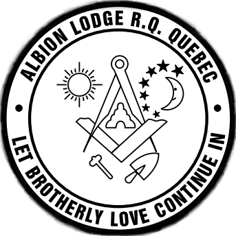
    </a>
</div>

--- 

<!-- FIN ENTETE -->

# Le Quatrième Soldat  

## TVF Lt-Col Charles Alexander Young, MC, VD 1895-1963

```
Legend 

[[[ text ]]]  - original text written up for the article
{{{ text }}}  - text paraprasing a source text; question, observation, of a source text
no-delimiters - direct copy from a source text.
```

||CIVIL DATA|
|---|---|
|Name|[Charles Alexander Young](https://www.ancestry.ca/family-tree/person/tree/197335275/person/332580256962/facts)|
|Date of birth|Nov 26th 1895|
|Place of birth|County of York, Toronto, ON|
|Father|[Alexander Young](./ayoung.md)|
|Mother|Annie Buxton Young, née Gardiner|
|Next of kin|Alexander Young, father, 24 St-Julia St, Quebec City, QC|
|Occupation|Machinist, metalworking machine setter-operator|
|Religion|Methodist ([Chalmers Wesley United Church](https://chalmerswesley.org/), Quebe City, QC)|
|Date of death|Oct 2nd 1963|
|Place of death|Toronto, ON|
|Age at death|67 y-o|
|Burial site|[Mount Hermon Cemetery](https://www.mounthermoncemetery.com/), Quebec City, QC. <br/> Lot #1804, Section K. <br/> GPS coords: [46.7787065583,-71.2467289583](https://www.google.com/maps/search/?api=1&query=46.7787065583,-71.2467289583) |

[[[ 

Son of Major Alexander 'Alex' Young (52nd Battalion) and Annie Buxton Young (née Gardiner); husband of Nursing Sister Lieutenant Irene May Young (née Fellows).

Before the Great War, he was a cadet and then a member of the Militia in Québec, serving within the ranks of the 8th Regiment.

At First World War, he served the Canadian Machine Gun Corps, firstly with a rank of Sergeant, then commissioned to Lieutenant, teaching Machine Gun usage and bayonet combat to the troops in England, before being dispatched to the French front.

After the Great War, he joined the Royal Rifles of Canada (RRC) and rose through the ranks to become Lieutenant-Colonel and commanding officer of the regiment in 1934.

At Second World War, by the end of 1941, he is sent with the Royal Rifles to improve the defense of the colony of Hong Kong. This was a request from the British War Cabinet that Canada complied. On Dec 8th 1941, the day after Pearl Harbor attack, the Japanese attacked the colony. The defenders, British, Indian, Hong Kong volunteers and Canadians, put up a defense and were able to resist up to the 24th. On Christmas day, seeing that further resistance would be futile, the governor ordered all troops to surrender and avoid further life loss.

Brother Charles was captured after the end of the battle, on Dec 28th. He was the last to surrender command. He and his last troops were then captured. He was sent to the prisoner camp system, inside which he would spend the rest of the war, up to September 1945.

]]]

## First World War

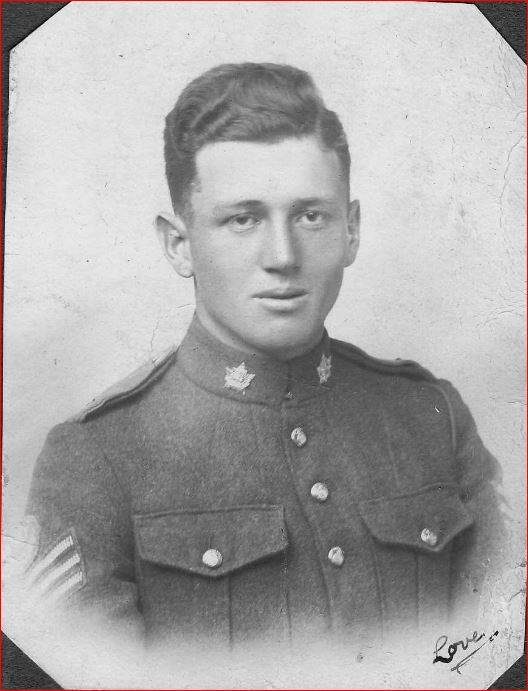 

**Sgt Charles Alexander Young, 12th Battalion. Source: family photo.**

|||
|---|---|
|Service|Canadian Expeditionary Force|
|Date of Enlistment|Sept 29th 1914|
|Units|12th Battalion, CEF|
||CMGC Canadian Machine Gun Corps, 4th Btn|
|Regimental number|22822|
|Highest rank|Lieutenant|
|Degree of service|Europe|
|LACID|[330882](https://www.bac-lac.gc.ca/eng/discover/military-heritage/first-world-war/personnel-records/Pages/item.aspx?IdNumber=330882)|
|Service File|[B10645-S029](https://central.bac-lac.gc.ca/.item/?op=pdf&app=CEF&id=B10645-S029)|
|Reference|RG 150, Accession 1992-93/166, Box 10645 - 29|
|Item Number|330882|
|Record Group|Canadian Expeditionary Force (CEF)|
|Demobilization date| June 12th 1919, Québec City, QC|
|Medals and awards | Military Cross, British War Medal, Victory Medal|

Sgt Charles Alexander served in the 8th Regiment "Royal Rifles" from 1908. With the irruption of the war, details from the 8th, 9th and 87th regiments were put on active service for local protection duty. On Aug 10 1914, the 12th Battalion, CEF was authorized and elements from these regiments composed its contingent. [^8thReg]. Sgt Charles Alexander is considered fit for active duty overseas on Sept 29 1914, by Dr R A Sutherland, Capt. AMC, and embarks towards Great Britain aboard the SS Scotian, arriving in England Oct 14th 1914. [^Voyage]? The battalion continued embarked until the 25th, when it is authorized to disembark and march towards the Bustard Camp, on the Salisbury Plain[^Salisbury]. 

> [!TIP]
> Curiosity: Salisbury Plain is the same region where Stonehenge is located!

### Timeline of the Great War 

June 3rd 1916 - Death of his father, Major [Alexander Young](./ayoung.md), in Ypres, Belgium.

**11th Canadian Infantry Brigade MG Coy**
- Aug 12th 1916 - Disembark at Le Havre   
- **[SOMME]**   
- Oct 21st to Nov 11th 1916 - Battle of the Somme (Regina and Desire trenches)

**16 MCG Coy** 
- **[VIMY]**
- Apr 9th to 11th 1916 - Battle of Vimy Ridge   
- **[PASSCHENDAELE]**   
- June 3rd 1917 - Action near La Coulette
- June 27th 1917 - Action near Avion
- Oct 27th 1917 - Action at Decline Copse 

**4th CMGC**  
- **[CANADA 100 DAYS]**
- Aug 9th to 11th 1918 - Battle of Amiens 
- Sep 1st to 2nd 1918 - Battle of Drocourt-Queant
- Sep 27th to Oct 1st 1918 - Battle of Canal du Nord 
- Nov 1st to 2nd 1918 - Battle of Valenciennes 


[^8thReg]: https://www.canada.ca/en/department-national-defence/services/military-history/history-heritage/official-military-history-lineages/lineages/infantry-regiments/voltigeurs-quebec.html
[^Voyage]: https://www.canadiansoldiers.com/regiments/cef/012battalion.htm
[^Salisbury]: [The First Canadian Contingent on Salisbury Plain](https://militaryandfamilyhistory.blog/2014/10/25/the-first-canadian-contingent-on-salisbury-plain/)

**Rank detail:**     
1. Lieutenant (Army) 1918-03-19 to 1919-06-12    
2. Lieutenant (Army) 1917-08-31 to 1918-03-19    
3. Lieutenant (Army) 1917-04-14 to 1917-08-30    
4. Sergeant   (Army) 1917-02-01 to 1917-04-14    
5. Sergeant   (Army) 1916-06-13 to 1917-02-01    
6. Sergeant   (Army) 1915-10-14 to 1916-06-13    
7. Quarter-Master Sergeant, 12th Battalion, Infantry (Army) 1915-08-23 to 1915-10-14    
8. Sergeant, 12th Battalion, Infantry (Army) 1914-09-29 to 1915-08-23  

**In the Canadian Emma Gees:**    
p 116 - 4th Btn CMGC Headquarters    
p 166 - Lieut Young wounded

**From the Certificate of Service:** 

He served in CANADA, England and France with the 12th Battalion. 11th Brigade Machine Gun Company. 16th Canadian Machine Gun Company. Canadian Machine Gun Pool, and 4th Battalion CMCG, and was STRUCK OFF THE STRENGTH on the Twelfth day of June 1919 by reason of General Demobilization.  

> [!IMPORTANT]
> **Awards:**   
> Military Cross  
> Date of award: 1919-06-03   
> Source: The Fifth Supplement to the London Gazette(of Friday 3 May 1919), issue 31370 page 6837 [^MC]   
> There was no citation since it was awarded in the Kings birthday honours list.

  [^MC]:(https://www.thegazette.co.uk/London/issue/31370/page/6837)    
  *Lt. Charles Alexander Young, 4th Bn., Can.    
  M.G. Corps*

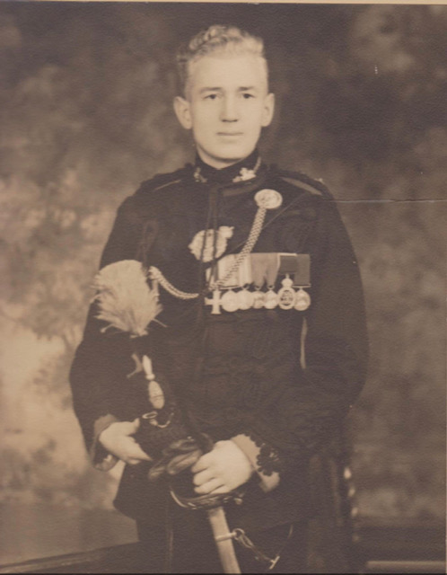 

**Lt Charles Alexander Young, 4th Battalion CEF, Canadian Machine Gun Corps. Source: family photo.**

---

 
## World War II
<div align="center">
  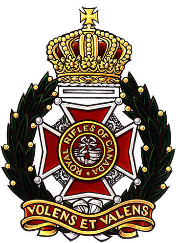
  <p></p>
</div>

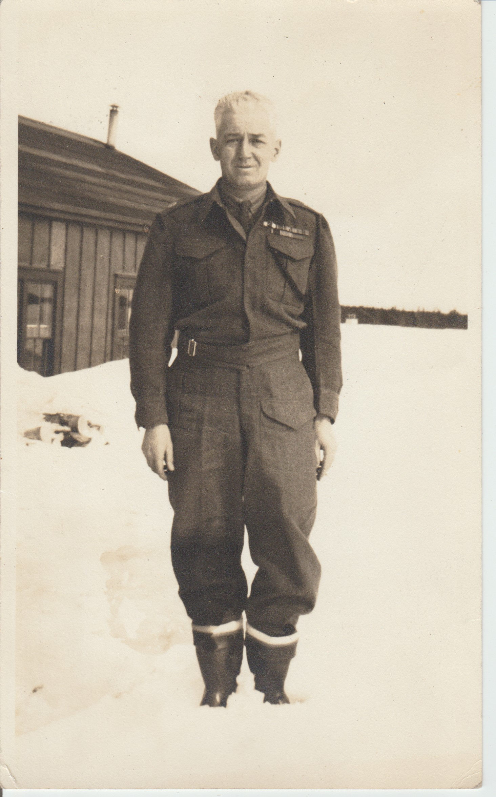
 
**Maj Charles Alexander Young, on garrison duty at Newfoundland, before the Hong Kong mission. <br /> Source: family photo.**

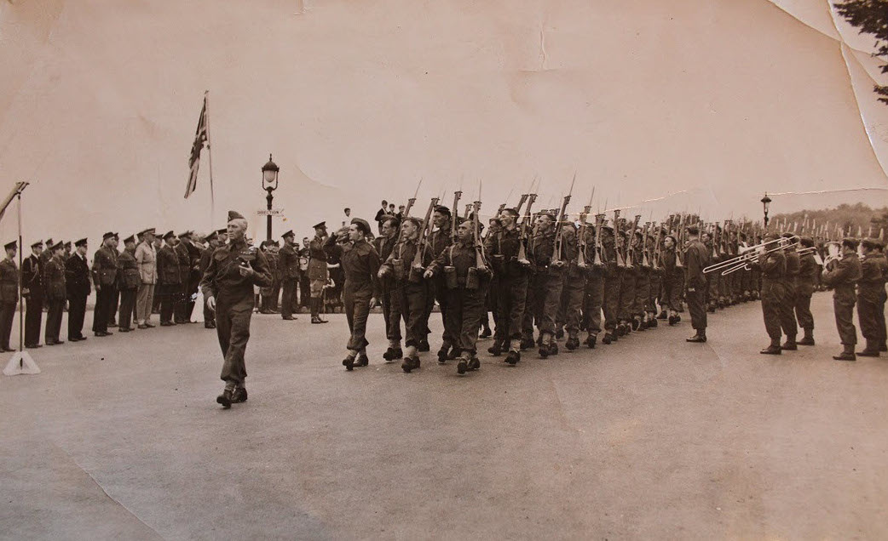

**Maj Charles Alexander Young, parading the 1st Btn "A" Coy for inspection in Quebec City, before embarking to the Hong Kong mission.<br />Source: family photo.**

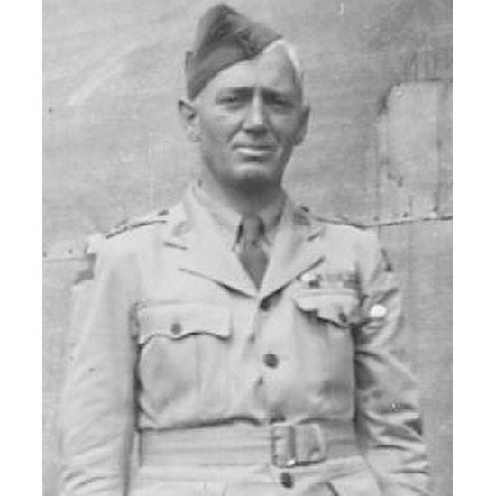

**Maj Charles Alexander Young, 1st Btn "A" Coy, The Royal Rifles of Canada, C Force. <br />Source: Copied with permission from the HKVCA Photo Gallery. Copyright remains with the original owner.**


|| World War II |
|---|---|
|Force|Army - 1st Btn The Royal Rifles of Canada.|
|Rank|Major |
|Appointment| Company Commander |
|Company| "A" |
|Platoon| Coy HQ|
|Service Number (regimental)|X96 (reference number valid only for HKVCA's site)|
|POW|from Dec 30, 1941 to Sep 10, 1945|
|Decorations|Military Cross, Volunteer's Officer Decoration|
|Highest Rank|Lieutenant-Colonel|
|||

Commanding officer of the "A" Coy, 1st Btn RRC
                           7th, 8th and 9th Platoons

### The demand for troops 

*The British Government formally requested that Canada provides two infantry battalions for Hong Kong on 19 September 1941. Lawson's Directorate of Military training and Staff Duties had evaluated the battalions under consideration - the Royal Rifles of Canada (RRC) and the Winnipeg Grenadiers - as "not suitable" for deployment due to their long service in garrison duties in the West Indies and in Newfoundland and their requirement for further training. But the battalion's experience in garrison duties arguably made them well suited for what was expected to be much the same in Hong Kong. Hostilities with Japan were not yet considered imminent."* (Wentzell 2021, p. 3-4)

### **Information retrieved from Bro Charles HKVCA's profile site**

**Transportation** 

- Travelled from the East Coast {{ probably from Québec City }} across Canada by CNR troop train
- Reinforcements en route:
  - Valcartier, Montreal, Ottawa, Armstrong (ON), Capreal(ON), Winnipeg, Melville(SK), Saskatoon, Edmonton, Jasper and Vancouver
- Arrived at Vancouver on Oct 27th at 0800 hrs
- All troops embarked on the ships AWATEA and PRINCE ROBERT.
- C Coy of RRC was on PRINCE ROBERT, everyone else on the AWATEA.
- Sailed from Vancouver Oct 27th
- Arrived in HK on Nov 16th, after brief stops at Honolulu and Manila.
- Equipment embarked on DON JOSE, which would never reach HK; diverted to Manila after the beginning of hostilities.
- On arrival, troops were qurtered at Nanking barracks, Sham Shui Po Camp, in Kowloon.
 
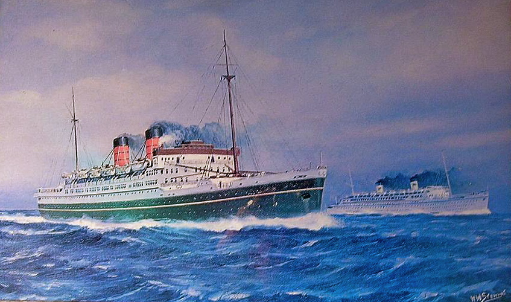

**The HTS Awatea. Souce: [Cruise Line History](https://www.cruiselinehistory.com/the-tss-awatea-union-steamship-company-overtakes-the-ss-mariposa-matson-lines-august-1938/)**


### **Battle**


**After the destruction of the regiment on the aftermath of the Battle of Hong Kong, the Royal Rifles of Canada started a recruitment campaign to rebuild the regiment. <br /> Source: Canada War Museum.**

<b>Liste des camps de prisonniers et les dates d'internement et de sortie</b> 


|Camp ID 	|Camp Name 	|Location  	|Arrival Date 	|Departure Date|
|---|----|----|---|---|
|HK-NP-01	|North Point	|North Point, Hong Kong Island|   41 Dec 30	|42 Sep 26|
|HK-SA-02	|Shamshuipo	    |Kowloon, Hong Kong|              42 Sep 26	|43 Aug 19|
|HK-AS-02	|Argyle Street	|Kowloon, Hong Kong|        	  43 Aug 19 |44 May 11|
|HK-SA-02	|Shamshuipo	    |Kowloon, Hong Kong|      	      44 May 11	|45 Sep 10|

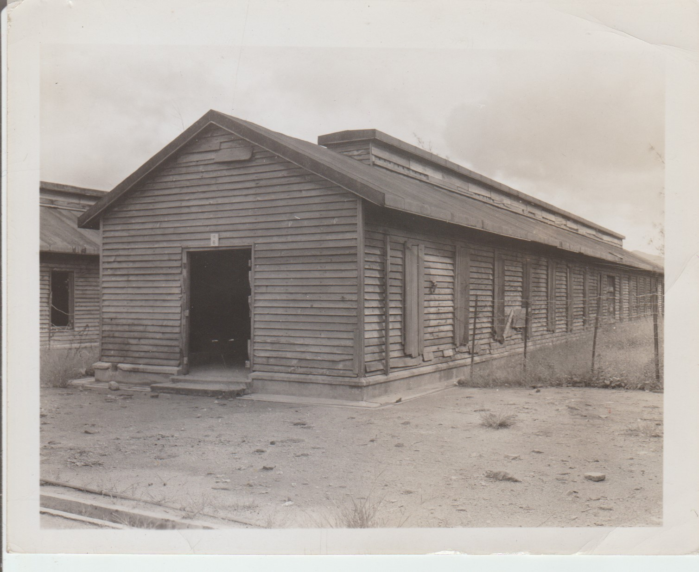

**Photo of a typical POW barrack in Honk Kong, where the canadian troops were kept. <br/>Source: family photo.**

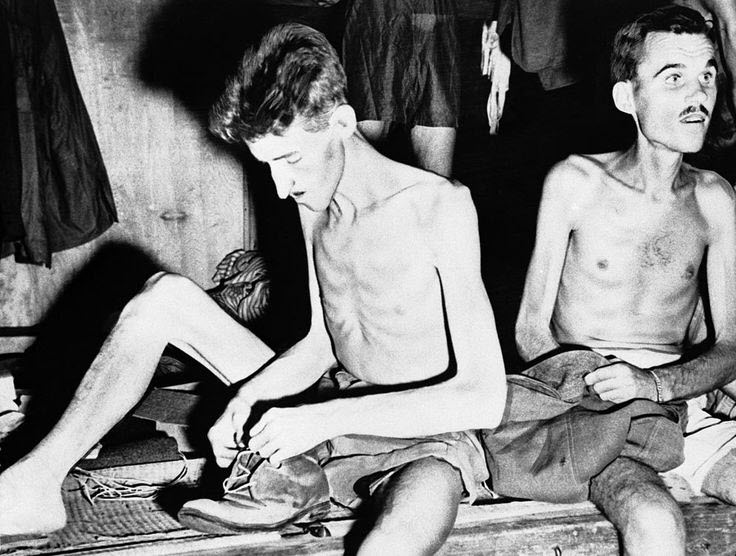

**POW released from Sendai camp. Rifleman James Andrew Flanagan on the left. <br />Source: Copied with permission from the HKVCA Photo Gallery. Copyright remains with the original owner.**

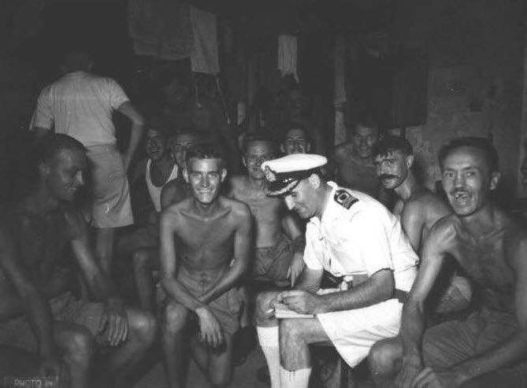

**Commander Ritchea interviewing liberated soldiers.  <br />Source: Copied with permission from the HKVCA Photo Gallery. Copyright remains with the original owner.**


**In the fourth row from the bottom, 3rd from the left is X96 Major Charles A. Young of the Royal Rifles of Canada. <br/>Apparently this photo was taken just after liberation. <br/>Source: Copied with permission from the HKVCA Photo Gallery. Copyright remains with the original owner.**

## Brother Charles' War Diary 

Brother Charles kept a diary throughout the captivity period where he and other fellows jotted down, scribbled, and let out on paper the fellings of being held prisoners.  

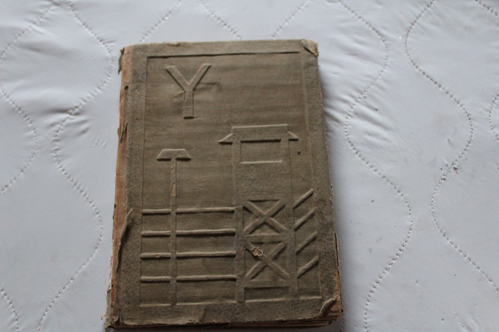
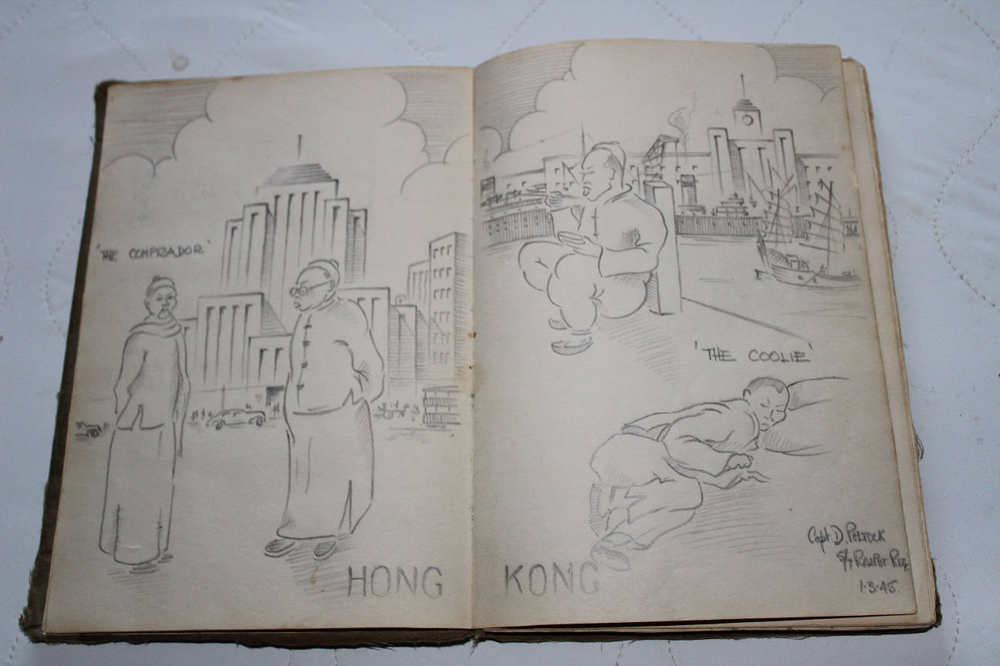
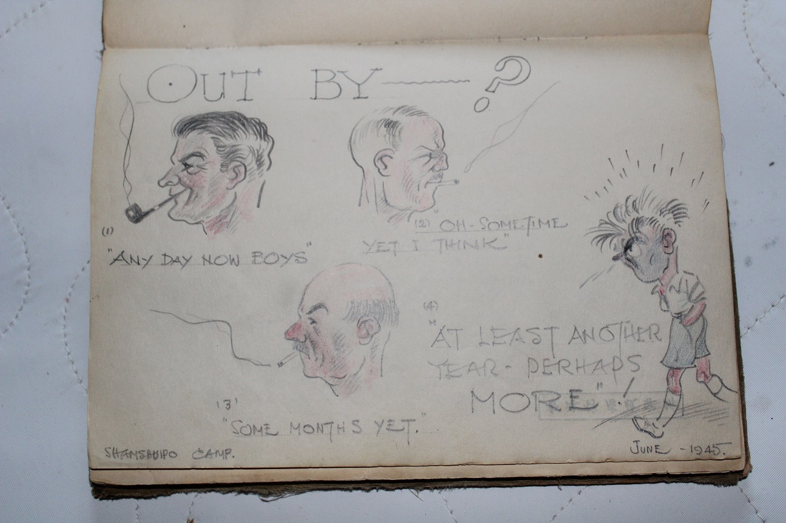
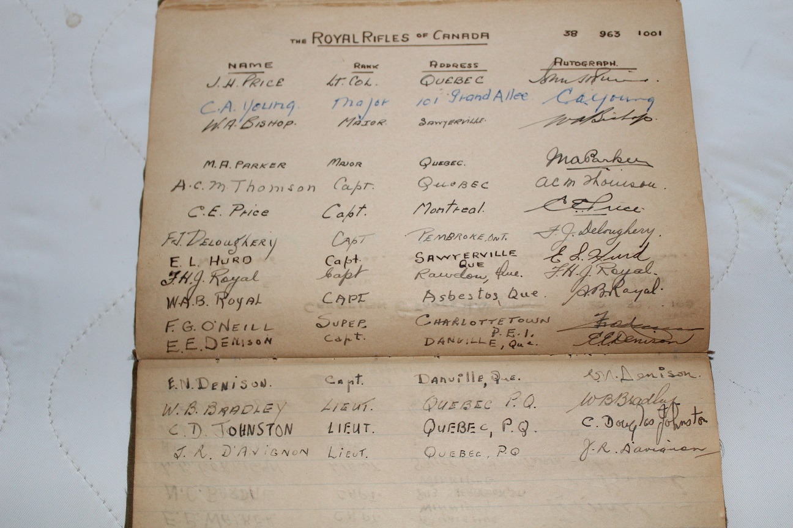
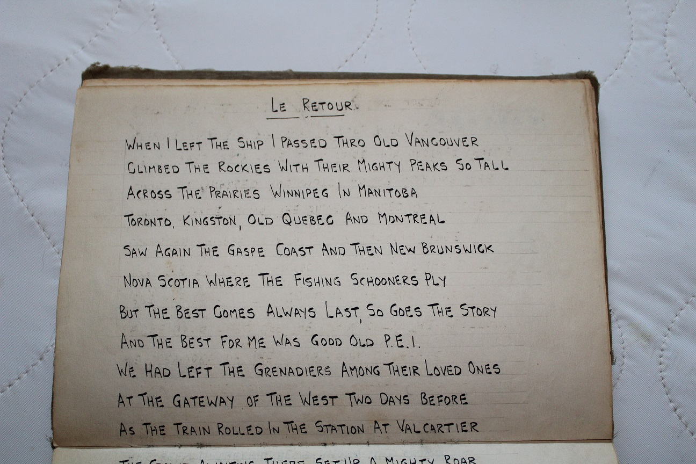
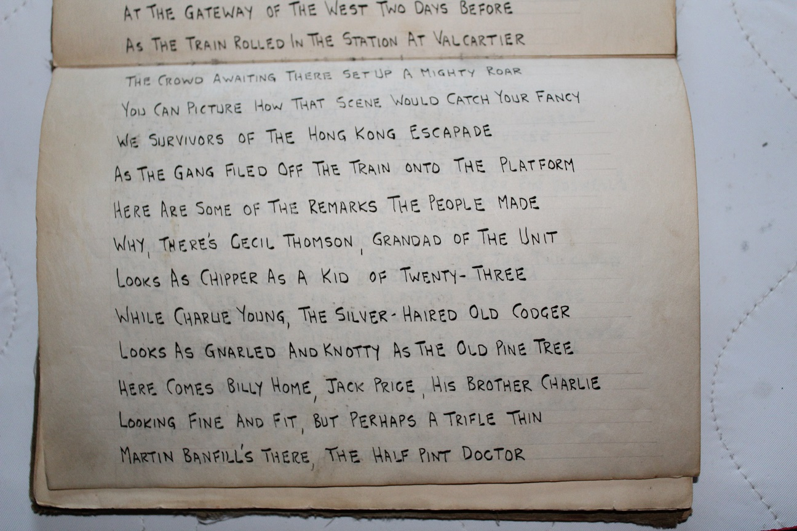
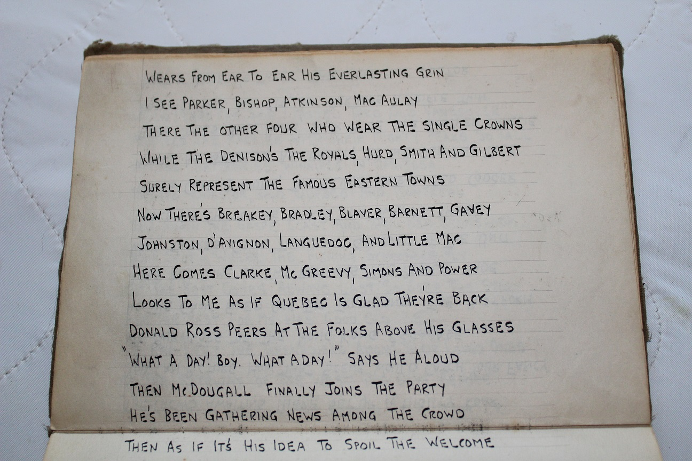
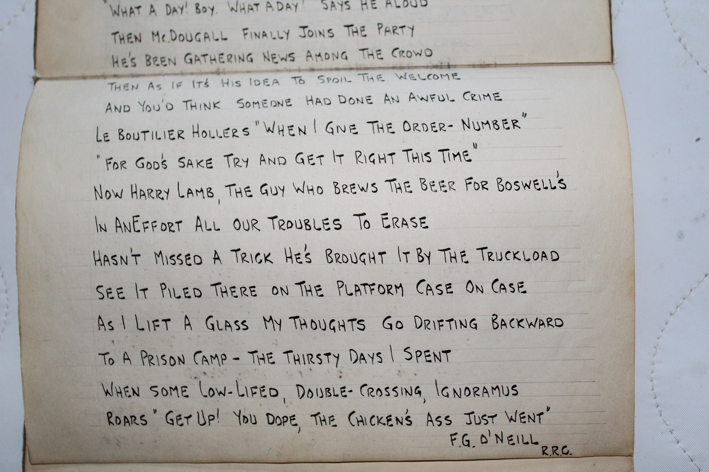

**All the photos are provided by the kind contribution of Mrs Thompson-Castagnette, who takes active steps in preserving her family's memory.**

## Arriving Home, post-war years

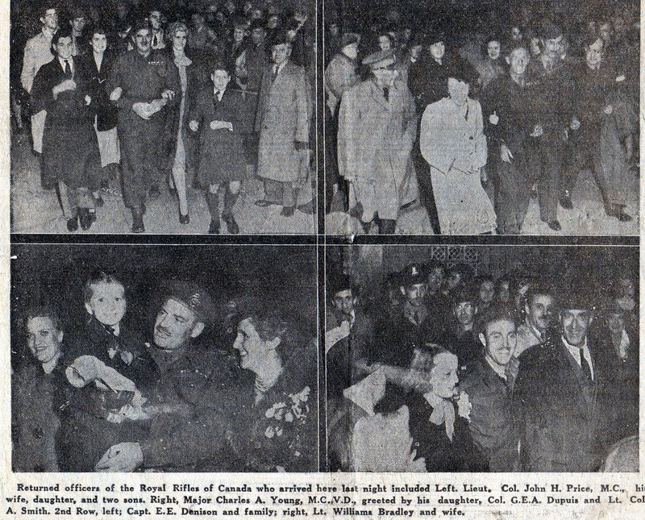

**RRC Officers arrival at Quebec City. Maj Charles Alexander on the top-right photo, with his daughter Florence May Young. <br /> Source: Copied with permission from the HKVCA Photo Gallery. Copyright remains with the original owner.**

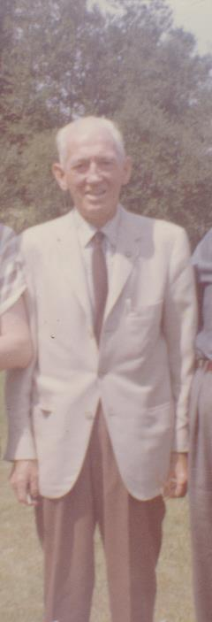

**Lt-Col Charles Alexander Young, in the years after the war. Source: family photo.**


### Obituaries 

**Obituary and Albion's Invitation  Chronicle, 1963-10-03, p. 12**[^Obt1]   
[^Obt1]: https://news.google.com/newspapers?nid=9tXw7Op4-u0C&dat=19631003&printsec=frontpage&hl=en    

YOUNG - Suddenly at Toronto, Ont. on October 2nd 1963, Lt-Col C.A. Young, MC, VC, ED, beloved husband of the late Irene Fellows and dear father of Donald and Phyllis (Mrs Harry Thompson). Resting at the D.S. Rickaby Funeral Home, 707 St John Street, corner Geneviève (...). Funeral Saturday, at 2.00 service in Chalmers Wesley Church, Interment Mount Hermon Cemetery. 

**ALBION LODGE**
A Masonic Service will be held for our late brother, Charles Alexander Young, at D.S. Rickaby Funeral Parlor, 707 St John Street, on Friday, October 4th at 8.00 pm.

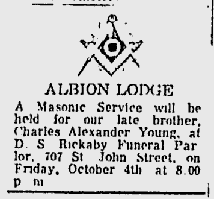

**Info about Lt-Col Young. Chronicle, 1963-10-05, p. 3**[^Obt2]   
[^Obt2]: https://news.google.com/newspapers?nid=9tXw7Op4-u0C&dat=19631005&printsec=frontpage&hl=en

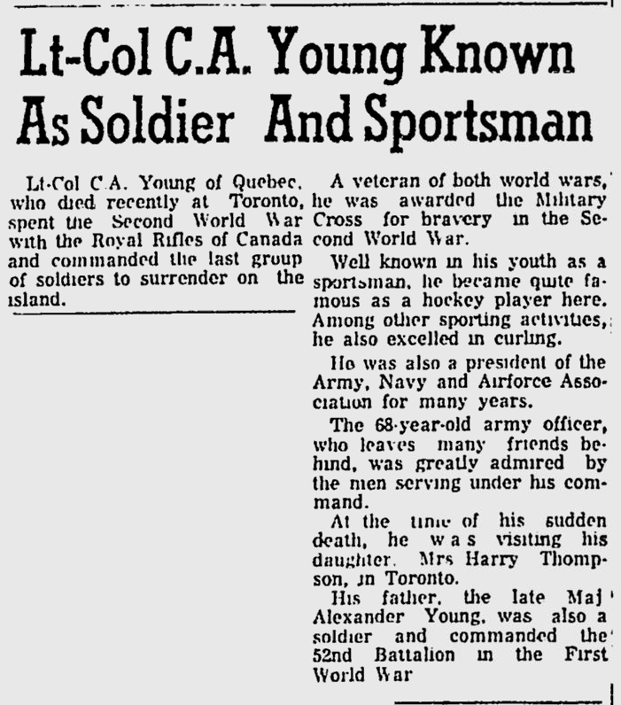

**Lt-Col C.A. Young Known as a Soldier and Sportsman** 

Lt-Col C.A. Young of Quebec, who died recently at Toronto, spent the Second World War with the Royal Rifles of Canada and commanded the last group of soldiers to surrender on the island. 

A veteran of both world wars, he was awarded the Military Cross for bravery in the Second (sic) World War. 

Well known in his youth as a sportsman, he became quite famous as a hockey player here. Among other sporting activities, he also excelled at curling. 

He was also a president of the Army, Navy and Airforce Association for many years. 

The 68-year-old army officer, who leaves many friends behind, was greatly admired by the men serving under his command. 

At the time of his sudden death, he was visiting his daughter, Mrs Harry Thompson, in Toronto. 

His father, the late Maj Alexander Young, was also a soldier and commanded the 52nd Battalion in the First World War. 

**Gravestone** 

His final resting place is in Québec City Cemetery Mount Hermon, in a quiet part of the city, in the most peaceful place inside the cemetery, near its centre, where the silence and peace reign absolute for his eternal rest. 


The tomb is located in lot #1840, section K, and is located by the GPS coordinates [46.7787065583,-71.2467289583](https://www.google.com/maps/search/?api=1&query=46.7787065583,-71.2467289583). Use the QRCode below to get the Google instructions to the gravesite. 


# Family

## Arbre généalogique

Arbre généalogique approximative de la famille du Fr Charles Alexander Young. J'ai identifié à date trois générations de la famille qui ont appartenues à la franc-maçonnerie (quatre personnes ayant appartenu à Albion), et quatre générations qui ont appartenues aux Forces Canadiennes, dans le service militaire actif dans des zones de conflit (Northwest Rebellion, Boer War, Great War, WWII et guerre de la Corée). 

Brother Alexander Young was a Major at the time he fell in the [Battle of Sactuary Wood](https://www.veterans.gc.ca/eng/remembrance/memorials/hill-62) (Hill 62) near Ypres; before, he had fought the Campaign in South Africa. 

Brother Alfred Grincell Fellows was a most beloved Sergeant-Major of 8th Regt RCGA in Québec City, who passed away before the war. He was lamented by a large crowd in his inhumation.

Brother William Grincell Fellows served in the Northwest Rebellion, and afterwards served as a Sergeant-Major in the Royal Canadian Regiment. He helped create the Railway Construction Regiment just before the Great War. He was a Major at the time, and could not be deployed with the Regiment because of health issues, what eventually led to his retirement from the Force. 

His sister, Florence May Young was a Nursing Sister in the war, decorated with the Associate Royal Red Cross, Second Class. And his wife, who he met in Europe during the war, was also a Nursing Sister! 


<map name="image_map">
  <area alt="Lt-Col Charles Alexander Young" title="Lt-Col Charles Alexander Young" href="./4emeSoldat.md" coords="356,285 356,341 444,342 444,323 473,322 474,284 473,282 473,285 473,285 473,285 " shape="polygon">
  <area alt="Major Alexander Young" title="Major Alexander Young" href="./majAYoung.md" coords="275,143,395,204" shape="rect">
  <area alt="Sergeant-Major Alfred Grincell Fellows" title="Sergeant-Major Alfred Grincell Fellows" href="./sgmAGFellows" coords="444,144 446,204 526,206 527,193 564,193 564,145 " shape="polygon">
  <area alt="Lieutenant Irene May Young" title="Lieutenant Irene May Young" href="./ltIMYoung.md" coords="445,324,564,382" shape="rect">
  <area alt="Major William Grincell Fellows" title="Major William Grincell Fellows" href="./majWGFellows.md" coords="676,145,795,206" shape="rect">
  <area alt="Harry Ralph Thompson" title="Harry Ralph Thompson" href="./hrThompson.md" coords="796,175,797,175" shape="rect">
</map>

[His father: Maj TVF Alexander Young](./ayoung.md)

[His Wife: Lieut Irene May Young](./imyoung.md)

[His Father-in-law: SGM Alfred Grincell Fellows](./agfellows.md)

[His Wife's Uncle: Maj TVF William Grincell Fellows](./wgfellows.md)

[His son-in-law: Fr Harry Ralph Thompson](./hrthompson.md)


## Membres de la famille ayant étés Vénérable Maîtres d'Albion

Right Worshipful Brother William Grincell Fellows had the distinction of being the Worshipful Master of the two oldest lodges in Québec: Antiquity Lodge No.1 in 1899 and Albion Lodge No.2 in 1908. 

Right Worshipful Brother Alexander Young was the Master of the Lodge for the year of 1913, shortly before deploying to the European theatre on First World War, where he would pay the ultimate sacrifice for his country.


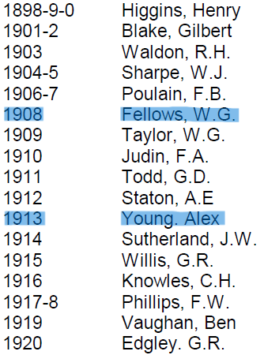

**Past-Masters de la Loge Albion, débuts 20 siécle. Source: convocations de la Loge**

# Memorabilia

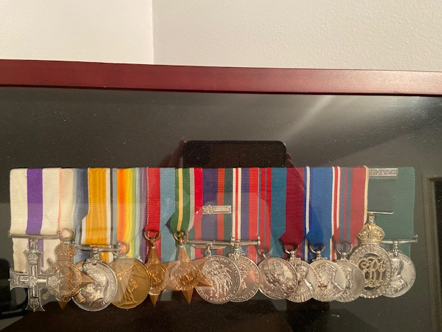

**Médailles du Lt-Col Charles A Young. Source: family photo**

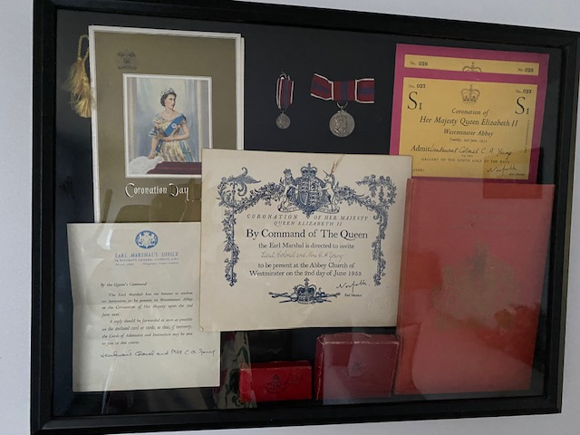

**Souvenirs de la présence à la Coronation de la Reine Elizabeth II, à l'Abbaie de Westminster, le 2 juin 1953. Source: family photo**

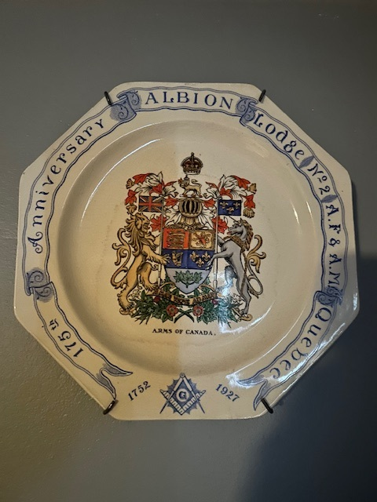

**Plat commemoratif des 175 ans de la loge Albion donné au Fr Charles Alexander Young. Source: family photo**

# TODO

ALBION 

- Possibilité d'en discuter avec le T V Fr Arthur Ward - il était le VM de la loge lors du décès du Fr Young
- Vérifier dans les archives les dates d'Initiation, passage et élévation du Fr Charles Young 
- Checker s'il y a des faits saillants sur Fr Young dans les procès-verbaux de la secrétaire
- Vérifier si l'on a une statistique de la proportion de frères qui sont militaires dans l'active, ou qui sont passés par les forces. 
- Vérifier les données du TVF William Grincell Fellows (oncle de l'épouse) - vénérable Maître d'Albion l'année 1908
- Vérifier les données du Fr Alfred Grincell Fellows (Père de l'épouse)
- Vérifier auprès des archives si les frères Alfred Fellows, bien comme le frère Charles, étaient des membres effectifs d'Albion ou d'autre loge
- Demander le logo de la loge à Éric ou à Richard 

OTHER TASKS

- [OK] Vérifier si le Fr Harry Ralph Thompson (beau-fils - mari à Phylis) était membre de la loge - **Non, il était membre de la Riverdale Lodge #494, à l'Orient de Toronto.** 
- Acheter un shooter extra pour faire cadeau à Jayne 
- Check with Jayne des infos sur le service militaire de son père 
- [OK] Écrire un résumé du drama des Fellows 
- Faire recherche au registre foncier de la municipalité de Lac-St-Joseph pour retrouver le challet familial. 

# References 


## Bibliography
[Booth 2016] Booth, Wayne C. The Craft of Research. 4e ed. Chicago : University of Chicago Press, 2016.

[Castonguay 1987a] Castonguay, J. **Les Voltigeurs de Québec: Premier régiment canadien-français, Vol. 1.** Quebec: Voltigeurs de Québec, 1987.

[Castonguay 1987b] Castonguay, J. **Les Voltigeurs de Québec: Premier régiment canadien-français, Vol. 2.** Quebec: Voltigeurs de Québec, 1987.

[Flanagan 2017] Flanagan, Andy. The Endless Battle : The Fall of Hong Kong and Canadian POWs in Imperial Japan. Fredericton (NB) : Goose Lane Editions, 2017. 

[Grafton 1938] Lt Col C. S. Grafton. **The Canadian ’Emma Gees’: A History of the Canadian Machine Gun Corps.** Uckfield, UK: The Naval and Military Press, 1938.

[Graham 1892] Graham, J. H. Outlines of the History of Freemasonry in the Province of Quebec. Montréal: John Lovell & Son, 1892. 645 p.

[HKVAC 1980] Hong Kong Veteran’s Association of Canada. **The Royal Rifles of Canada in Hong Kong:1941-1945.** Progressive Publications, Sherbrooke, QC, 1980.

[HSCMH 1941] Historical Section Canadian Military Headquarters. **Canadian participation in the Defence of Honk Kong, December, 1941.** Department of National Defense, Ottawa, 1946. 
https://publications.gc.ca/collections/collection_2016/mdn-dnd/D63-4-163-1946-eng.pdf

[Jünger 1929] Jünger, E. **In Stahlgewittern: Aus dem Tagesbuch eines Stoßtruppführers.** Berlin: E S Mittler Sohn, 1929.

[Lodge of Antiquity 1906] Lodge of Antiquity. By-Laws of The Lodge of Antiquity Ancient Free and Accepted Masons: Being Number One on the Registry of the Most Worshipful The Grand Lodge of Ancient Free and Accepted Masons of Quebec. Montreal: Self published, 1906, 17 p.

[Love 1999] Love, D. W. **A Call to Arms: The Organization and Administration of
Canada’s Military in World War One.** Calgary, AB: Bunker to Bunker Books, 1999.

[Miller 1993] Miller, C. Painting the Map Red: Canada and the South African War 1899-1902. Montreal: Canadian War Museum, 1993. 541 p.

[Nevinson 1963] Nevinson, Harry M. History of the Lodge of Antiquity. Montreal: Self published, 1963, 52, 120.

[Penny 1962] Penny, A. G. **The Royal Rifles of Canada ’Able and Willing’ since 1862: A Short History.** Quebec City: Royal Rifles of Canada, 1962.

[Pöhlmann 2017] Pöhlmann, Markus. "A Portrait of the Soldier as a Young Man: Ernst Jünger at
Fresnoy, April 1917". Journal of Military and Strategic Studies, 18, no. 2 (2017): 105-117. https://jmss.org/article/download/58297/43850/158926

[Smith 1939] Smith, Pemberton. A research into Early Canadian Masonry 1759-1869. Montréal: Quality Press, 1939. 135 p. Copy: #197

[Smith 2024] Smith, F. Des Québécois en Normandie: Du jour J à la libération de Paris. Montréal: Boréal, 2024.

[Storr 2020] Storr, Will. The Science of Storytelling. New York : Abrams, 2020. 

[Wentzell 2021] Wentzell, Tyler. "Brigadier J.K. Lawson's Diary: October to December 1941".  Canadian Military History Journal, 20, no. 2 (2021): 3-4. https://scholars.wlu.ca/cgi/viewcontent.cgi?article=2070&context=cmh


## Official records

Library and Archives Canada - Personnel records of the First World War  
https://www.bac-lac.gc.ca/eng/discover/military-heritage/first-world-war/personnel-records/Pages/item.aspx?IdNumber=330882

### War Diaries 

[RRC War Diary] https://www.hkvca.ca/Gallery/Individuals/Maj%20Charles%20Young/index.htm

[DO-11CMGCoy.pdf] 11th Canadian Infantry Brigade Daily Orders: June 8 1916 – August 10 1916

[WD-11CIBde.pdf] 11th Canadian Infantry Brigade War Diary: August 14 1916 – November 30 1916

[WD-11CIBde-part2.pdf] 11th Canadian Infantry Brigade War Diary Part 2: December 1 1916 – May 31 1917

[WD-16CMGCoy.pdf] 16th Canadian Machine Gun Company War Diary: December 27 1916 – March 31 1918

[WD-4BnCMGCorps.pdf] 4th Battalion, Canadian Machine Gun Corps War Diary: January 1 1918 – March 25 1919


## Charles Alexander's profiles 

Imperial War Museum - Lives of the First World War   
https://livesofthefirstworldwar.iwm.org.uk/lifestory/5807192

Canadian Great War Project   
https://canadiangreatwarproject.com/person.php?pid=193906

Je me souviens   
https://www.worldanvil.com/w/je-me-souviens/a/young2C-charles-alexander--ww2--person

Individual Report: X96 Charles YOUNG (Details from HKVCA).   
https://www.hkvca.ca/cforcedata/indivreport/indivdetailed.php?regtno=X96

## Links to web pages 

Hong Kong Veterans Commemorative Association,   
https://www.hkvca.ca/cforcedata/unitreport/index.php 

HKVCA Vault. Search by reg'l number     
https://drive.google.com/drive/folders/1u0605cQjINZtg6Xp33LPBr4FxOQ1MOcJ

Hong Kong War Diary : a project that documents the 1941 defence of Hong Kong, the defenders, their families, and the fates of all until liberation.    
http://hongkongwardiary.com/

54 Rifles in Jap's hands.    
https://www.proquest.com/docview/2158853737/ED9F788F4219403CPQ/2?accountid=8612&sourcetype=Historical%20Newspapers

CANADIAN PARTICIPATION IN THE DEFENCE OF HONG KONG, DECEMBER, 1941   
https://www.ibiblio.org/hyperwar/UN/Canada/CA/163-HongKong/index.html#pow

Book Battle of Hong Kong   
http://battleofhongkong.com/19.htm

Report #163: Canadian participation in the defense of Hong Kong, Department of Defense    
https://www.ibiblio.org/hyperwar/UN/Canada/CA/163-HongKong/index.html

Ancient toponymes in Québec City   
https://www.ville.quebec.qc.ca/citoyens/patrimoine/toponymie/anciens_toponymes.aspx

Canadian Military History Journal - 
For its fall 2021 issue, Canadian Military History has published a special issue to commemorate the Battle of Hong Kong’s eightyth anniversary. This issue explores various aspects of the battle, its aftermath and its memory.    
https://scholars.wlu.ca/cmh/vol30/iss2/

ANAVETS - The Army, Navy and Air Force Association   
Association dont fr Charles a été le président pendant l'année 1953   
https://www.anavets.ca


## Newspapers clippings


[Evenement 1905-10-27] L'événement, 1905-10-27, Collections de BAnQ. Nouvelles Sport: Concours d'hier-Sts resultats, Association de tir de Quebec.    
https://numerique.banq.qc.ca/patrimoine/details/52327/4578767

[QcChronicle 1907-08-03] The Quebec chronicle, 1907-08-03, Collections de BAnQ. Trap Shoot Prizes: Programme of Dominion Association in Toronto next week.   
https://numerique.banq.qc.ca/patrimoine/details/52327/3608333

[QcChronicle 1910-02-03] The Quebec chronicle, 1910-02-03, Collections de BAnQ. Annual sports of RCR.   
https://numerique.banq.qc.ca/patrimoine/details/52327/3609109

[QcChronicle 1910-11-30] The Quebec chronicle, 1910-11-30, Collections de BAnQ. Shooting on miniature ranges. *(Charles champion de la Challenge Cup. Son père, seconde place dans la catégorie seniors de la Wm McPherson Cup)*.   
https://numerique.banq.qc.ca/patrimoine/details/52327/3609365

[ActionSociale 1910-11-30] L'action sociale, 1910-11-30, Collections de BAnQ. Le tir: un concours intéressant. *(Charles champion de la Challenge Cup. Son père, seconde place dans la catégorie seniors de la Wm McPherson Cup)*.   
https://numerique.banq.qc.ca/patrimoine/details/52327/2783875

[Soleil 1910-11-30]Le soleil, 1910-11-30, Collections de BAnQ. Le tir: En miniature. *(Charles champion de la Challenge Cup. Son père, seconde place dans la catégorie seniors de la Wm McPherson Cup)*.   
https://numerique.banq.qc.ca/patrimoine/details/52327/3481922

[QcChronicle 1914-03-26] The Quebec chronicle, 1914-03-26, Collections de BAnQ. Good showing in basketball games.   
https://numerique.banq.qc.ca/patrimoine/details/52327/3610392

[Soleil 1914-03-26] Le soleil, 1914-03-26, Collections de BAnQ. Basketball Trois bonnes jutes.   
https://numerique.banq.qc.ca/patrimoine/details/52327/3479737

[QcChronicle 1916-06-08] The Quebec chronicle, 1916-06-08, Collections de BAnQ. Three Quebecers lose their lives.     
https://numerique.banq.qc.ca/patrimoine/details/52327/3611081 

[QcChronicle 1916-06-12] The Quebec chronicle, 1916-06-12, Collections de BAnQ. METHODIST CHURCH MEMORIAL SERVICE.    
https://numerique.banq.qc.ca/patrimoine/details/52327/3611084 

[QcChronicle 1923-11-10] The Quebec chronicle, 1923-11-10, Collections de BAnQ. Dance at Drill Hall.   
https://numerique.banq.qc.ca/patrimoine/details/52327/3613413

[GazetteQuebec 1957-03-30] Gazette officielle du Québec. Québec official gazette, 1957-03-30, Collections de BAnQ, p. 1128. Cambrai Bowling Alleys Inc *(Charles Alexander as a businessman)*.     
https://numerique.banq.qc.ca/patrimoine/details/52327/2358987

[QcChronicle 1963-10-03] Quebec Chronicle, 1963-10-03. Obituary Charles Alexander Young.   
https://news.google.com/newspapers?nid=9tXw7Op4-u0C&dat=19631003&printsec=frontpage&hl=en 

[QcChronicle 1963-10-05] Quebec Chronicle, 1963-10-05. Lt-Col C.A.Young known as Soldier and Sportsman.   
https://news.google.com/newspapers?nid=9tXw7Op4-u0C&dat=19631005&printsec=frontpage&hl=en 

[Tribune 1993-02-01] La tribune, 1993-02-01, Collections de BAnQ. Les soldats canadiens auraient été lâches à Hong Kong en 41.    
https://numerique.banq.qc.ca/patrimoine/details/52327/3801544

[NYTimes 2016-12-23] The New York Times, 2016-12-23. A Doomed Battle for Hong Kong, With Only Medals Left 75 Years Later. 
https://www.nytimes.com/2016/12/23/world/canada/a-doomed-battle-for-hong-kong-with-only-medals-left-75-years-later.html 


## Articles - academic, journaux

Perras, Galen. **Defeat Still Cries Aloud for Explanation: Explaining C Force’s Dispatch to Hong Kong.** Valour (Vol. 11, No. 4).  
http://www.journal.forces.gc.ca/vo11/no4/37-perras-eng.asp  French: http://www.journal.forces.gc.ca/vo11/no4/37-perras-fra.asp

St Croix, Bradley. **FIGHTING IT OUT: CANADIAN TROOPS AT HONG KONG AND IN MEMORY.** Thesis, University of Ottawa.  
https://www.hkvca.ca/st_croix/thesis.pdf

Maltby, Christopher. **OPERATIONS IN HONG KONG FROM 8TH TO 25th DECEMBER, 1941.** Supplement to the London Gazette, 27th of January, 1948. 
http://ibiblio.org/hyperwar/UN/UK/LondonGazette/38190.pdf

## Videos 

Hong Kong Reinforced. British Pathé.   
https://www.youtube.com/watch?v=ZWY3atYUFQU

##  Acknowledgements / Remerciements  

### **Société de Généalogie de Québec**   

https://www.sgq.qc.ca/

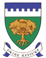

The courses on genealogical research offered by the Société de Généalogie du Québec allowed me to pursue the research of a richer set of documents that added to the density of sorces I had available to draw a picture of Brother Charles Alexander's life. 

### **Mrs Jayne Thompson-Cascagnette** 

Brother Charles' granddaughter, whose help with personal and family insight were invaluable to the consecution of the project. 

She's also provided great photos that allowed a peek into the private life of Brother Charles Alexander. 

# Annexes
## Annex A - **Decorations**   

**Military Cross, MC**  
La Croix militaire peut être décernée aux officiers de grades ne dépassant pas le grade effectif de capitaine (autrement dit, les majors à titre temporaire et par intérim y sont admissibles) ou aux adjudants, en reconnaissance de services distingués et méritoires au combat. En 1920, les conditions ont été modifiées afin de préciser clairement que la Croix devait reconnaître les services courageux et distingués en présence de l’ennemi, et que les officiers de la marine et de l’aviation pouvaient l’obtenir pour des services courageux et distingués au sol. - Anciens Combattants Canada.[^2]   

[^2]: https://www.worldanvil.com/w/je-me-souviens/a/croix-militaire-item

Identifying the need to recognize junior commissioned officers and senior non-commissioned officers, the Military Cross was established on 28 December 1914 for commissioned officers of the substantive rank of Captain or below and for Warrant Officers. It was awarded for gallant and distinguished service in battle and recipients were entitled to the post-nominal letters MC.[^3]   
[^3]: https://www.warmuseum.ca/tilston-medals-collection/medals/25/

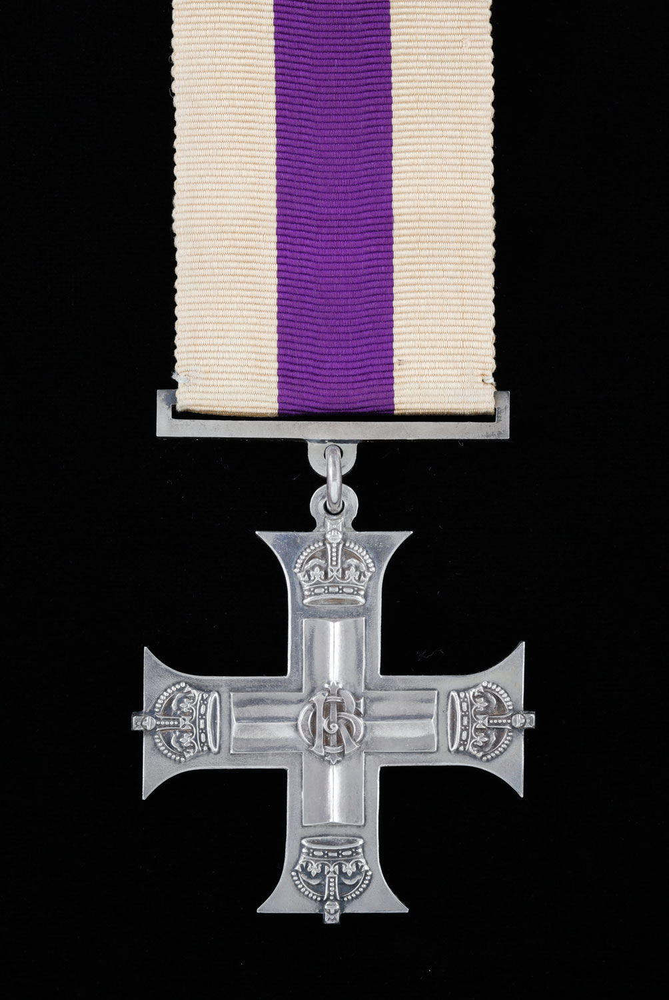

**Volunteer Officers' Decoration, VD**   
The Volunteer Officers' Decoration, post-nominal letters VD, was instituted in 1892 as an award for long and meritorious service by officers of the United Kingdom's Volunteer Force. Award of the decoration was discontinued in the United Kingdom when it was superseded by the Territorial Decoration in 1908, but it continued to be awarded in some Crown Dependencies until 1930.

The Volunteer Officers' Decoration, post-nominal letters VD and colloquially known as the Volunteer Decoration, was instituted by Queen Victoria's Royal Warrant on 25 July 1892. The decoration could be awarded to efficient and thoroughly capable officers of proven capacity for long and meritorious service in the part-time Volunteer Force of the United Kingdom.[^VD]

[^VD]: [Voluntary Officers' Decoration](https://en.wikipedia.org/wiki/Volunteer_Officers%27_Decoration#:~:text=The%20Volunteer%20Officers'%20Decoration%2C%20post%2Dnominal%20letters%20VD%20and,Warrant%20on%2025%20July%201892)


## Footnotes
