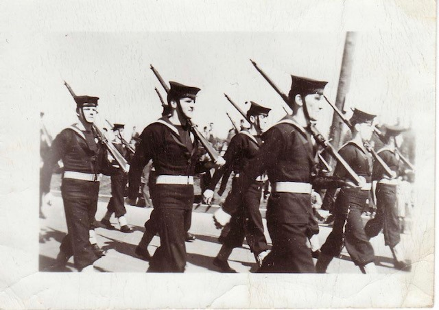
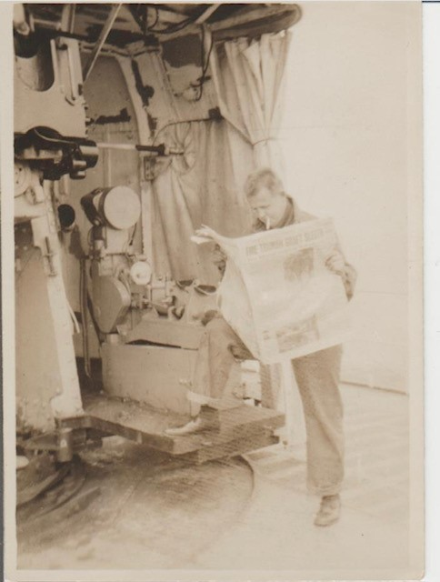
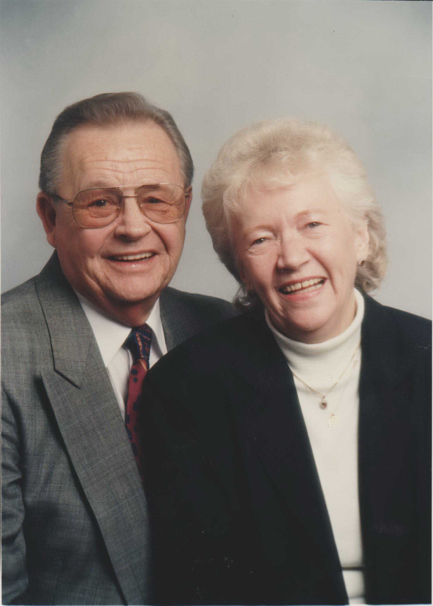
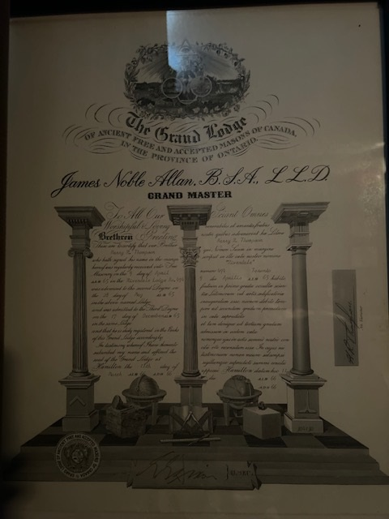
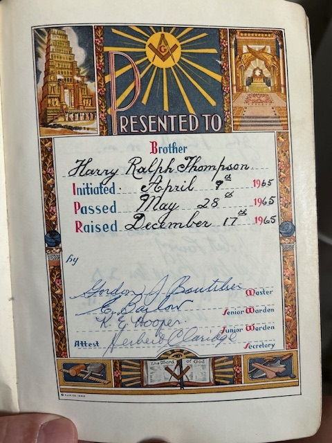
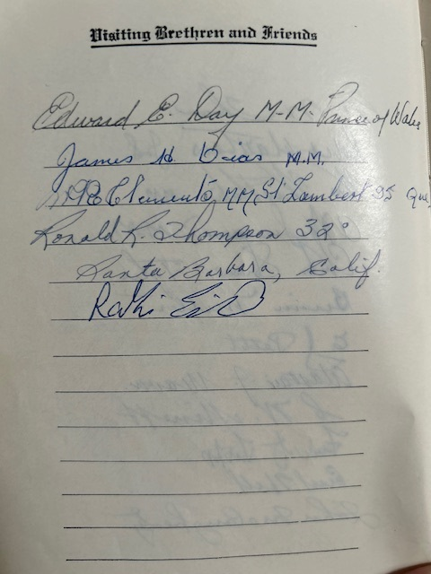
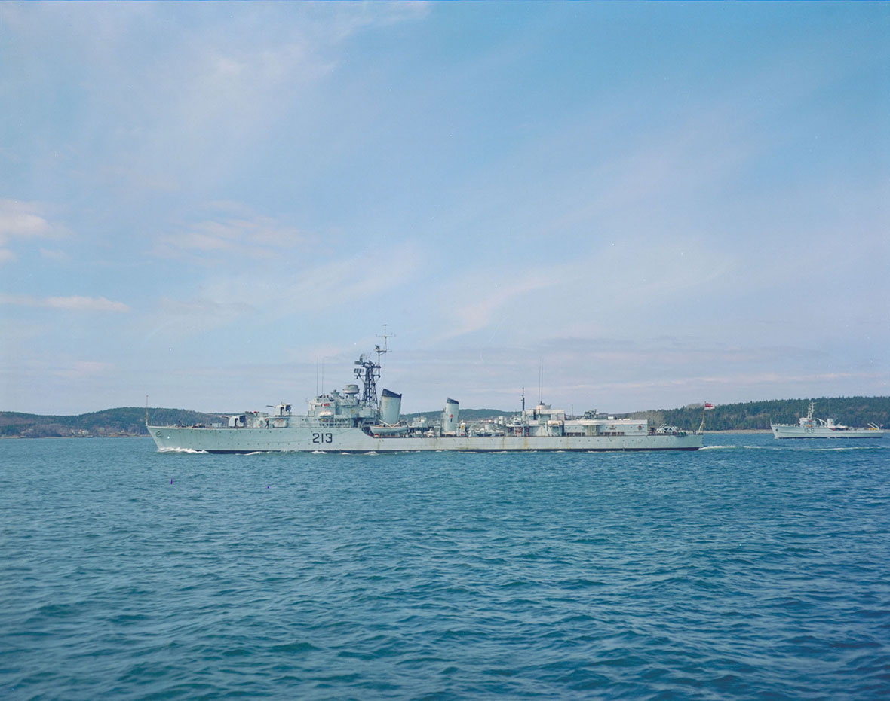
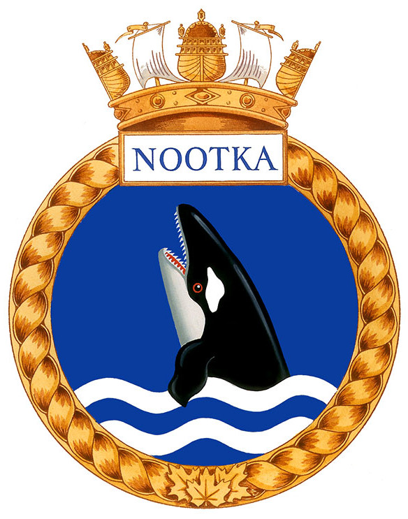

<!-- ENTETE -->

---

    

--- 

<!-- FIN ENTETE -->

# **Chief Petty Officer Harry Ralph Thompson**

||CIVIL DATA|
|---|---|
|Name|Harry Ralph Thompson|
|Date of birth|April 22,1929|
|Place of birth|Rosemont, Montréal|
|Father|William Thompson|
|Mother|Mathilda Thompson, née Erskine|
|Next of kin||
|Occupation|Navy Military|
|Religion||
|Date of death|November 9, 1998|
|Place of death|Elliot Lake, Ont|
|Age at death|69 years-old|
|Burial site|Etobicoke, Ont|

Harry Ralph Thompson was born April 22,1929 to William and Matilda (nee Erskine) Thompson in Rosemount, Montreal.  He was the youngest of 5 children.  His oldest brother Jack was killed in WWII and his name in inscribed in the Book of Remembrance in Ottawa. His two other brothers both served, Ronald in the Air Force and Douglas in the Navy.  Having only a Grade 6 education did not leave much room for employment so he worked as a milkman before signing up for the Navy even altering his birth certificate to sign up earlier than what was allowed.  He trained at Cornwallis and enrolled in the diver program.  He served mostly on the HMCS Nootka as both Hard Hat Diver and Frogman.  He saw action in Korea during the Korean War.  

**On marching order, Harry is in the middle of the line. Source: family photo.**

**Harry on board a ship, probably the HCMS Nootka. Source: family photo.**

He was married on October 31, 1952 to Phyllis Alexandra Young. He reached the designation of Chief Petty Officer by the end of his naval career being stationed mostly in Dartmouth. He sailed around the world and actually lost a day because he didn't sail back to Canada the way he had come, crossing the International Date Line only once.  It was always a joke that he was going to ask for his pay with interest.  He also served in the Arctic, Quebec and Nova Scotia.  He retired from the Navy before I was born in 1960.  His best friend William (Bill) Allen was instrumental in the construction of the Korean Wall of Remembrance in Mississauga.  

**The couple Harry Ralph Thompson and Phyllis Alexandra Thompson. Source: family photo.**

## Masonic life 
Initiated in [Riverdale Lodge #494](http://www.rjrr494.com/index.html) in April 9th 1965   
Grand Lodge of Canada in the Province of Ontario   

He was Received into the Brotherhood on April 9, 1965 at the <a href="http://www.rjrr494.com/officers.html">Riverdale Lodge #494</a> (Grand Lodge of Canada in Ontario), raised to 2nd Degree on May 28, 1965 and passed to the sublime 3rd Degree on December 17,1965.  His brother Ronald signed his Masonic Bible as 32nd Degree.

**Certificate Master Mason H R Thompson. Source: photo familliale.**

**First page of the Bible presented to Harry R Thompson. Source: photo familliale.**

**Visitors signing Bible of Harry R Thompson. Source: photo familliale.**

## HMCS Nootka 

Chief Petty Officer Thompson served in the HMCS Nootka in its tours of duty in the Korean theatre of war. 

|||
|---|---|
|Ship's name | HMCS Nootka (R96 / 213)|
|Class | Tribal class destroyer|
|Commission| Aug 7, 1946. Halifax, NS|
|Dismantlement| 1965, Faslane, Scotland|
|Displacement | 1958 tonnes |
|Dimensions| 114.9 x 11.4 x 3.4 m|
|Speed | 36 knots |
|Crew | 259 |
|Battle Honors| Korea 1951 / 1952|
|Motto | *"Tikegh Mmook Solleks (Ready to fight)"*| 

- Named after a first nation tribe.
- Commissioned on Aug 7, 1946, at Halifax, NS. 
- Converted to destroyer escort in 1949. 
- Korean duty - transited the Panama Canal for first of two tours of duty in the Korean theatre of war. 
- Second Canadian ship to circumnavigate the globe.
- After war resumed its original training duties. 
- Paid off at Halifax , Feb 6, 1964.  
- Broken up in Faslane, Scotland, in 1965. 

**Refs:** 

(“HMCS NOOTKA R96 / 213,” n.d.)

(Royal Canadian Navy, n.d.)

## **His Wife: Phylis Alexandra Thompson née Young**   
Phyllis Alexandra Thompson, née Young   
January 10th, 1931, Quebec City, QC — April 5th, 2020 Scarborough, ON
https://www.basicfunerals.ca/obituaries/Phyllis-Thompson

## References 

http://www.rjrr494.com/index.html

https://www.flickr.com/photos/21728045@N08/albums/

https://www.facebook.com/watch/?v=1072797941153028

“HMCS NOOTKA R96 / 213.” n.d. For Posterity’s Sake - A ROyal Canadian Navy Historical Project. Accessed December 12, 2024. http://www.forposterityssake.ca/Navy/HMCS_NOOTKA_R96_213.htm.

Royal Canadian Navy. n.d. “HMCS Nootka.” Ships’ Histories - HMCS Nootka. Accessed December 12, 2024. https://www.canada.ca/en/navy/services/history/ships-histories/nootka.html.
