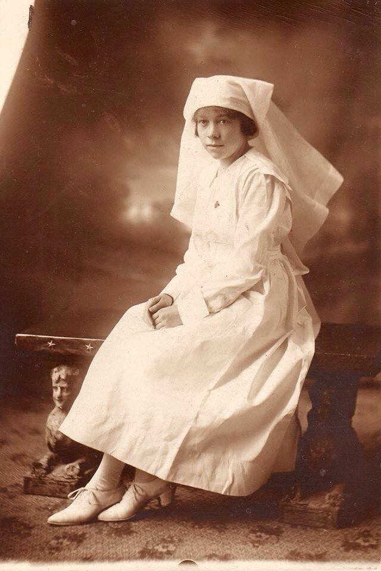

<!-- ENTETE -->

---

    

--- 

<!-- FIN ENTETE -->

# **Nursing Sister Lieut. Irene May Young née Fellows**
Irene May Fellows (Imperial War Museum - Lives of the First World War)    

||CIVIL DATA|
|---|---|
|Name|[Irene May Young, née Fellows](https://www.ancestry.ca/family-tree/person/tree/197335275/person/332580256963/facts)|
|Date of birth|Sept 16th 1894 |
|Place of birth|Quebec, PQ |
|Baptism| Oct 14th 1894, Anglican Saint Mathew's Church; Québec|
|Father|Alfred Grincell Fellows|
|Mother|Catherine Agnes Fellows, née Black|
|Occupation|Seller; Nursing Sister|
|Religion|Church of England (Anglican)|
|Date of death|Dec 5th 1958|
|Place of death|Quebec, QC|
|Age at death|64 years-old|
|Burial site|Mount Hermon, Plot 1804, https://findagrave.com/memorial/269803865/irene_may_fellows/|

Daughter of **Alfred Grincell Fellows** and **Catherine Agnes Fellows** (nee Black); wife of **Charles Alexander Young** (Service No. 22822)

## First World War 

Next of kin: Major William Grincell Fellows, uncle. 243 Fairmount Avenue, Montreal, Quebec   
Occupation (attested): Trained Nurse    
Address: 61 St. Cyrille Street, Quebec, Quebec
Buried: St. Catharines (Victoria Lawn) Cemetery    
Service: Canadian Expeditionary Force    	  
Unit: Canadian Army Medical Corps 	 
Rank: Nursing Sister (Lieutenant)	  
Service File:  [B3029-S033](https://central.bac-lac.gc.ca/.item/?op=pdf&app=CEF&id=B3029-S033)     

CAMC Medical Depot No.5     
Casualty Clearing Services Command, Qc   

# References 

## Bibliography

[Bowers 2024] Bowers, Alex. **Sisters Act: How the Great War's Canadian nurses brought comfort and care to patients while enduring their own personal turmoil.** In Legion Magazine, Vol. 99, No. 5, Sept/Oct 2024, pp. 30-35.

[Toman 2016] Toman, Cynthia. (2016). **Sister Soldiers of the Great War: The Nurses of the Canadian Army Medical Corps.** Vancouver: UBC Press.

# Web 

[Cascagnette 2024-08-29] Email Jayne Thompson, August 29th 2024.

[Jeffrey-Hale 1946] 81st Annual Report of Jeffery Hale's Hospital and Training School for Nurses for 1946, p.42. URL: https://collections.banq.qc.ca/ark:/52327/bs3186679 

IWM: https://livesofthefirstworldwar.iwm.org.uk/lifestory/5857947    
Great War Project: https://canadiangreatwarproject.com/person.php?pid=87189

Baptism: https://www.ancestry.ca/discoveryui-content/view/7066258:1091   
Census 1901: https://www.ancestry.ca/discoveryui-content/view/7966890:8826   
Census 1911: https://www.ancestry.ca/discoveryui-content/view/1666571:8947   
CEF Service file: https://www.ancestry.ca/discoveryui-content/view/1065783:61084   

Baptism Phyllis Alexandra: https://www.ancestry.ca/discoveryui-content/view/15613517:1091

Record of service – Overseas Military Forces of Canada medical units   

https://www.canada.ca/en/department-national-defence/services/military-history/history-heritage/official-military-history-lineages/ledgers/ww1-medical-units.html

Histoire de Jeffrey-Hale:   
https://www.ciusss-capitalenationale.gouv.qc.ca/jhsb/a-propos/notre-histoire  

https://www.ville.quebec.qc.ca/en/citoyens/patrimoine/quartiers/saint_jean_baptiste/interet/ancien_hopital_jeffery_hale.aspx

Gravesite:   
https://www.findagrave.com/memorial/269803865/irene-may-fellows