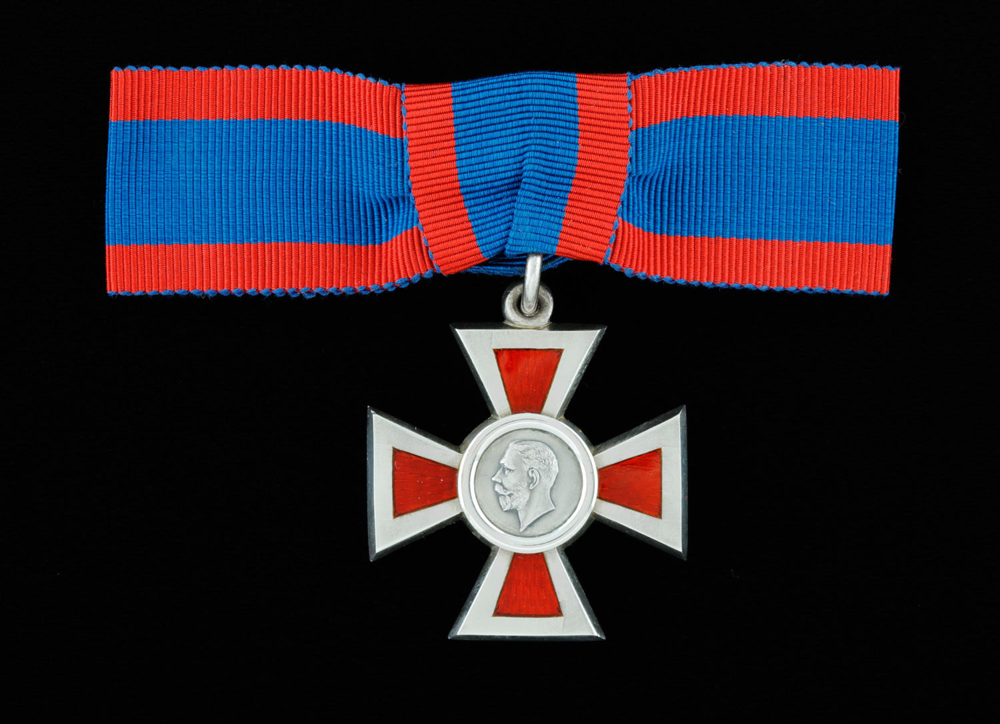

<!-- ENTETE -->

---

    

--- 

<!-- FIN ENTETE -->
# **Nursing Sister Lieut. Florence May Young**  

||CIVIL DATA|
|---|---|
|Name|[Florence May Young](https://www.ancestry.ca/family-tree/person/tree/197335275/person/332580344705/facts)|
|Date of birth|Aug 9th 1894|
|Place of birth|Halton, ON|
|Father|Alexander Young|
|Mother|Annie Buxton Young, née Gardiner|
|Next of kin||
|Occupation||
|Religion||
|Date of death|Feb 13th 1981|
|Place of death|Toronto, ON|
|Age at death|86 y-o|
|Burial site||

Sister Florence May Young, ARRC   

## Decoration

**Associate Royal Red Cross, 2nd Class**   

Citation: 

*"In recognition of her valuable service with the British Forces in Salonika, Greece."* 
 
Source: The London Gazette
https://www.thegazette.co.uk/London/issue/31095/data.pdf

# References 

## Bibliography

[Toman 2016] Toman, Cynthia. (2016). **Sister Soldiers of the Great War: The Nurses of the Canadian Army Medical Corps.** Vancouver: UBC Press.

# Annexes
## Annex A - **Decorations**   

**Associate Royal Red Cross, Second Class, ARRC**  

Associate Royal Red Cross, Second Class   

Nursing Sister, Army Auxiliary Nursing Service AANS

